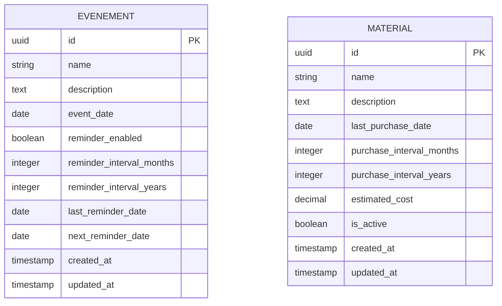

# Modèle Conceptuel de Données (MCD) - Application de Gestion de Soins Équin

## Vue d'ensemble

Le Modèle Conceptuel de Données décrit les entités principales de l'application et leurs relations, sans tenir compte des aspects d'implémentation technique.

---

## Entités

### 1. ÉVÉNEMENT (EVENT)

Représente un événement de soin récurrent pour un cheval (visite dentiste, parage, vaccination, etc.).

**Attributs :**

- **id** : Identifiant unique (UUID) - Clé primaire
- **nom** (name) : Nom de l'événement - Obligatoire
- **description** : Description détaillée - Optionnel
- **date_événement** (event_date) : Date de l'événement - Obligatoire
- **rappel_activé** (reminder_enabled) : Indique si les rappels sont activés - Booléen, défaut: false
- **intervalle_rappel_mois** (reminder_interval_months) : Intervalle de rappel en mois - Optionnel
- **intervalle_rappel_années** (reminder_interval_years) : Intervalle de rappel en années - Optionnel
- **dernière_date_rappel** (last_reminder_date) : Date du dernier rappel envoyé - Optionnel
- **prochaine_date_rappel** (next_reminder_date) : Date du prochain rappel à envoyer - Optionnel
- **créé_le** (created_at) : Date et heure de création - Automatique
- **modifié_le** (updated_at) : Date et heure de dernière modification - Automatique

**Règles métier :**

- Un événement doit avoir un nom et une date
- Si `rappel_activé` est vrai, au moins un intervalle (mois ou années) doit être défini
- `intervalle_rappel_mois` et `intervalle_rappel_années` sont mutuellement exclusifs (un seul doit être défini)
- `prochaine_date_rappel` est calculée automatiquement à partir de `date_événement` et de l'intervalle
- `modifié_le` est mis à jour automatiquement lors de toute modification

### 2. MATÉRIEL (MATERIAL)

Représente un matériel ou produit à acheter régulièrement (aliments, compléments, équipement, etc.).

**Attributs :**

- **id** : Identifiant unique (UUID) - Clé primaire
- **nom** (name) : Nom du matériel - Obligatoire
- **description** : Description détaillée - Optionnel
- **dernière_date_achat** (last_purchase_date) : Date du dernier achat effectué - Optionnel
- **intervalle_achat_mois** (purchase_interval_months) : Intervalle d'achat en mois - Optionnel
- **intervalle_achat_années** (purchase_interval_years) : Intervalle d'achat en années - Optionnel
- **coût_estimé** (estimated_cost) : Coût estimé du matériel - Optionnel, format décimal
- **actif** (is_active) : Indique si le matériel est actif - Booléen, défaut: true
- **créé_le** (created_at) : Date et heure de création - Automatique
- **modifié_le** (updated_at) : Date et heure de dernière modification - Automatique

**Règles métier :**

- Un matériel doit avoir un nom
- Si un intervalle d'achat est défini, `dernière_date_achat` devrait être renseignée pour calculer les prochains achats
- `intervalle_achat_mois` et `intervalle_achat_années` sont mutuellement exclusifs (un seul doit être défini)
- Un matériel inactif (`actif = false`) n'apparaît pas dans les listes actives par défaut
- `modifié_le` est mis à jour automatiquement lors de toute modification

---

## Relations

### Relations entre entités

**ÉVÉNEMENT** et **MATÉRIEL** sont des entités indépendantes qui ne partagent pas de relation directe dans le modèle actuel. Elles peuvent être considérées comme deux modules distincts de l'application.

---

## Diagramme MCD (Notation Merise)

```
┌─────────────────────────────────────┐
│           ÉVÉNEMENT                 │
├─────────────────────────────────────┤
│ id (PK)                             │
│ nom                                 │
│ description                         │
│ date_événement                      │
│ rappel_activé                       │
│ intervalle_rappel_mois              │
│ intervalle_rappel_années            │
│ dernière_date_rappel                │
│ prochaine_date_rappel               │
│ créé_le                             │
│ modifié_le                          │
└─────────────────────────────────────┘

┌─────────────────────────────────────┐
│           MATÉRIEL                  │
├─────────────────────────────────────┤
│ id (PK)                             │
│ nom                                 │
│ description                         │
│ dernière_date_achat                 │
│ intervalle_achat_mois               │
│ intervalle_achat_années             │
│ coût_estimé                         │
│ actif                               │
│ créé_le                             │
│ modifié_le                          │
└─────────────────────────────────────┘
```

---

## Diagramme MCD (Mermaid)



---

## Cardinalités

### ÉVÉNEMENT

- Un événement est unique (identifié par son id)
- Les événements sont indépendants les uns des autres

### MATÉRIEL

- Un matériel est unique (identifié par son id)
- Les matériels sont indépendants les uns des autres

---

## Contraintes d'intégrité

### Contraintes d'entité

- Chaque événement et chaque matériel doivent avoir un identifiant unique (UUID)
- Le nom est obligatoire pour les deux entités

### Contraintes de domaine

- `date_événement`, `dernière_date_rappel`, `prochaine_date_rappel` : format DATE
- `dernière_date_achat` : format DATE
- `créé_le`, `modifié_le` : format TIMESTAMP
- `rappel_activé`, `actif` : valeurs booléennes (true/false)
- `intervalle_rappel_mois`, `intervalle_rappel_années`, `intervalle_achat_mois`, `intervalle_achat_années` : entiers positifs
- `coût_estimé` : nombre décimal positif

### Contraintes fonctionnelles

- Pour un événement, si `rappel_activé = true`, alors au moins un intervalle doit être défini (mois OU années, pas les deux)
- Pour un matériel, si un intervalle d'achat est défini, il est recommandé de renseigner `dernière_date_achat`
- `prochaine_date_rappel` est calculée automatiquement : `date_événement + intervalle`
- `modifié_le` est mis à jour automatiquement à chaque modification via un trigger

---

## Évolutions possibles

### Extensions futures du modèle

1. **Entité CHEVAL** : Pour gérer plusieurs chevaux et associer les événements et matériels à des chevaux spécifiques
2. **Entité UTILISATEUR** : Pour la gestion multi-utilisateurs et l'authentification
3. **Entité RAPPEL** : Pour historiser les rappels envoyés
4. **Entité ACHAT** : Pour créer un historique des achats de matériel
5. **Entité CATÉGORIE** : Pour catégoriser les événements et matériels
6. **Relation entre ÉVÉNEMENT et MATÉRIEL** : Si certains événements nécessitent l'achat de matériel spécifique

---

## Notes techniques

### Implémentation actuelle

- Base de données : PostgreSQL
- Identifiants : UUID v4 générés automatiquement
- Index :
  - Sur `event_date` pour améliorer les requêtes de tri
  - Sur `next_reminder_date` pour les rappels à venir
  - Sur `last_purchase_date` pour les matériels à acheter
  - Sur `is_active` pour filtrer les matériels actifs
- Triggers : Mise à jour automatique de `updated_at` via fonction PL/pgSQL
- Cache : Redis utilisé pour mettre en cache les données fréquemment consultées

### Formats de données

- Dates : Format ISO 8601 (YYYY-MM-DD) pour les dates, TIMESTAMP pour les dates/heures
- UUID : Format standard UUID v4
- Décimal : DECIMAL(10, 2) pour les montants monétaires
